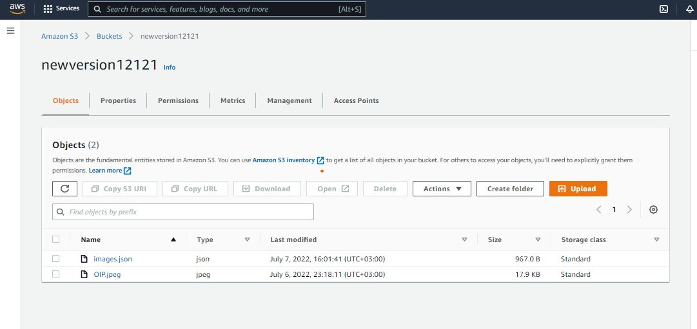
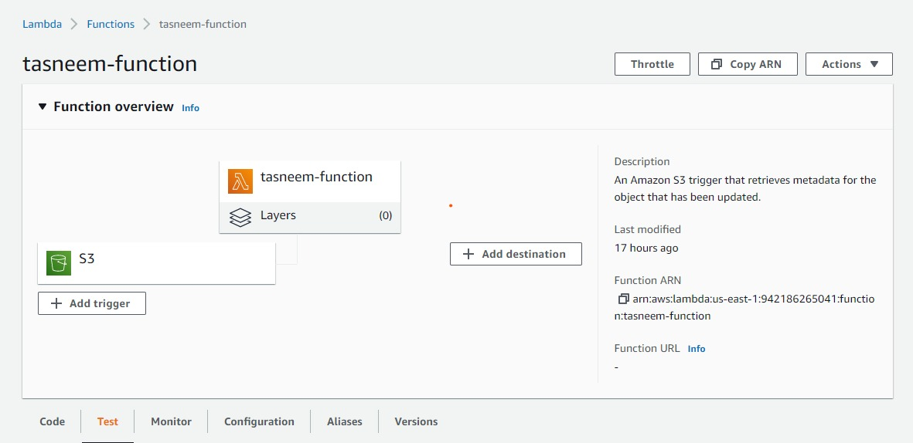

# image-lambda

## How lambda works

whenever we upload an image, the function will be excuted and the metadata of the image will be stored in the image.json

## imageJSON Link

[ImageJSON](https://newversion12121.s3.amazonaws.com/images.json)

## Uploaded Image

